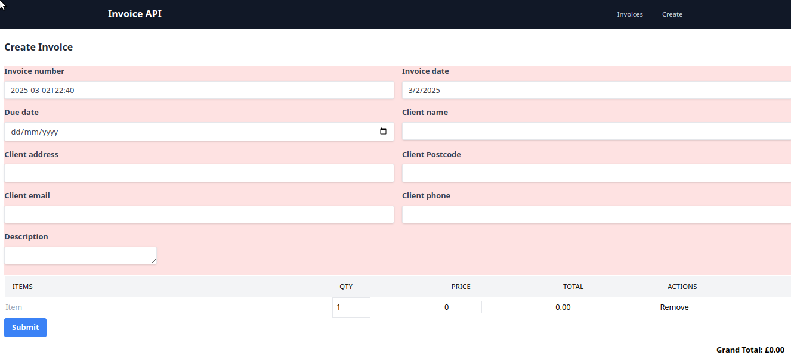
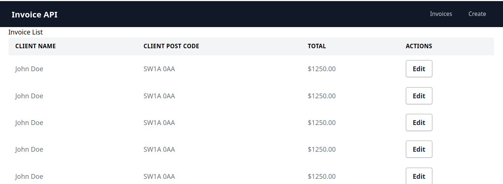
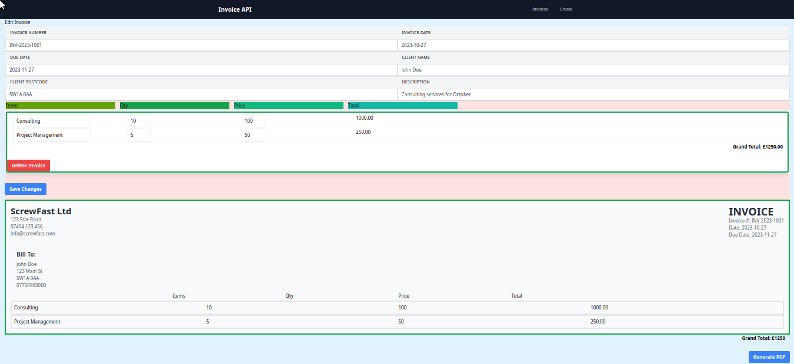

# Invoice pdf generator API

This is a RESTful API built with Express.js, React.js and SQLite for managing invoices. It allows you to create, retrieve, update, and delete invoices.

## Features

*   **Create Invoices:** Add new invoices to the system.
*   **Retrieve Invoices:** Get a list of all invoices or retrieve a specific invoice by ID.
*   **Update Invoices:** Modify existing invoices.
*   **Delete Invoices:** Remove invoices from the system.
*   **Data Persistence:** Uses SQLite to store invoice data persistently.
*   **CORS Enabled:** Supports Cross-Origin Resource Sharing, allowing frontend applications on different domains to interact with the API.
* **endpoint a:** has a get and post endpoint for demonstration.

## Technologies Used

*   **Node.js:** JavaScript runtime environment.
*   **Express.js:** Web application framework for Node.js.

*   **React.js:** JavaScript library for building user interfaces.

*   **SQLite:** Lightweight, file-based database.
*   **sqlite3:** Node.js driver for SQLite.
*   **CORS:** Node.js package for enabling CORS.
*   **body-parser:** Node.js middleware for parsing JSON request bodies.

## Setup and Installation

1.  **Clone the repository:**

    ```bash
    git clone https://github.com:micrometre/express-invoice.git
    cd  express-invoice
    ```

2.  **Install dependencies:**

    ```bash
    npm install
    ```

3.  **Start the server:**

    ```bash
    node index.js
    ```

    The server will start and listen on port 5000 (or the port defined by the `PORT` environment variable).


## Testing with curl

Here are examples of how to test the API using `curl`:

### Create an Invoice

```bash
curl -X POST -H "Content-Type: application/json" -d '{ "invoiceNumber": "INV-2023-1001", "invoiceDate": "2023-10-27", "fromDate": "2023-11-27", "clientName": "John Doe", "clientAddress": "123 Main St", "clientPostcode": "SW1A 0AA", "clientEmail": "john.doe@example.com", "clientPhone": "07700900000", "description": "Consulting services for October", "invoiceItems": [ { "name": "Consulting", "quantity": 10, "price": 100 }, { "name": "Project Management", "quantity": 5, "price": 50 } ], "grandTotal": 1250 }' http://localhost:5000/

```







![Update Invoices and Generate PDF](docs/
